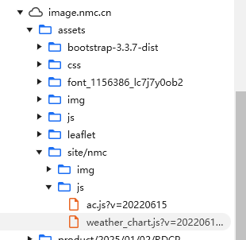

虽然目前无法直接生成图像，但我可以帮您详细描述一个适合的天气网站大屏设计，并给出一些具体的建议，您可以根据这些内容进行实现：

### 设计思路：

#### 1. **整体配色**：

- **主色调**：以蓝色为主色，考虑到天气网站通常与天空、空气等相关，可以使用渐变蓝色，配合白色或浅灰色，营造清新、清晰的视觉感受。
- **渐变效果**：顶部可以采用深蓝色，中间过渡到浅蓝或天空蓝，形成自然的天空色变化。背景可以使用轻微的渐变效果，避免纯色背景显得单调。

#### 2. **首页布局**：

- **顶部导航栏**：简洁的导航栏，包含网站Logo、当前城市、日期以及搜索框。字体使用清晰的无衬线字体（如Helvetica、Roboto等），颜色为白色或灰白色。
- **中央天气信息区**：
  - **大屏幕显示当前天气**：一个大数字区域显示当前温度，旁边是天气图标（如太阳、云朵、雨滴等）。天气图标应该简洁、现代化，采用明亮的颜色（如黄色、橙色、蓝色）。
  - **天气状况**：紧接着显示天气状况的简短描述（如“晴朗”、“多云”、“小雨”）。
  - **其他气象数据**：温度、湿度、风速、气压等信息通过小图标和简洁文字显示，图标采用圆形设计，图标和文字之间留有足够的空白，避免拥挤。

#### 3. **未来几天天气预报**：

- **横向滚动条**：展示未来几天的天气预报，每天的温度、天气情况、图标和最低/最高气温。这里可以设计为水平滚动卡片式布局，每个卡片展示一天的天气概览。
- **每个卡片**：卡片背景采用与当天天气相符的渐变色调（如晴天卡片为明亮黄色，雨天为蓝灰色）。每个卡片上放置小图标、日期、最高/最低温度。

#### 4. **互动区域**：

- **天气地图**：页面底部可以添加一个小的互动天气地图，用户可以点击查看不同城市或地区的天气情况。
- **自定义城市查询**：在页面显眼位置提供城市查询框，用户可以输入城市名称或选择当前所在城市。

#### 5. **字体与排版**：

- **字体**：使用简洁、现代的字体，确保文字清晰易读。标题部分可以采用稍大的字体，信息内容（如温度、湿度等）则可以采用中等或较小字体。
- **排版**：信息区域要有足够的间距，避免视觉上的拥挤。天气预报和图标要分层清晰，用户可以快速扫描并理解信息。

### 具体实现建议：

- 使用CSS渐变背景来实现背景的蓝色渐变效果。
- 采用SVG图标或高质量PNG图标来代表不同的天气条件。
- 使用Flexbox或CSS Grid布局来处理响应式设计，确保在不同屏幕尺寸下仍然表现良好。
- 通过JavaScript动态加载天气数据，可以使用天气API（如OpenWeatherMap）获取实时数据。

